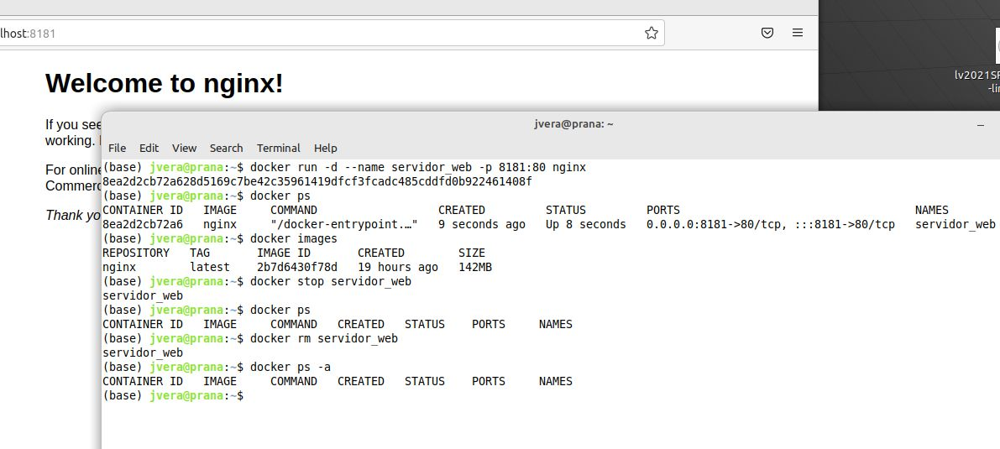
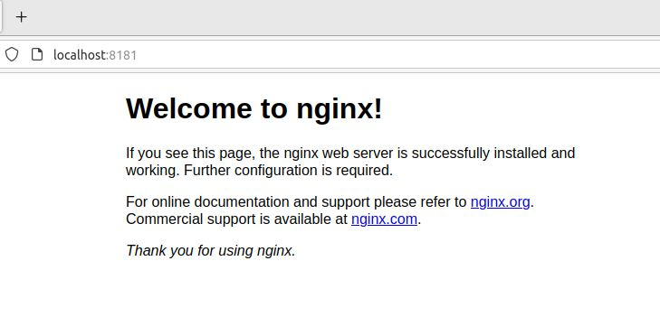

# Solucion Reto 1 Clase Docker

Comandos ejecutados para levantar un servidor Nginx :

````
docker run -d --name servidor_web -p 8181:80 nginx
docker ps
docker images
docker stop servidor_web 
docker ps
docker rm servidor_web 
docker ps -a

````







[Comandos en un archivo bash](./SolucionReto01.sh)