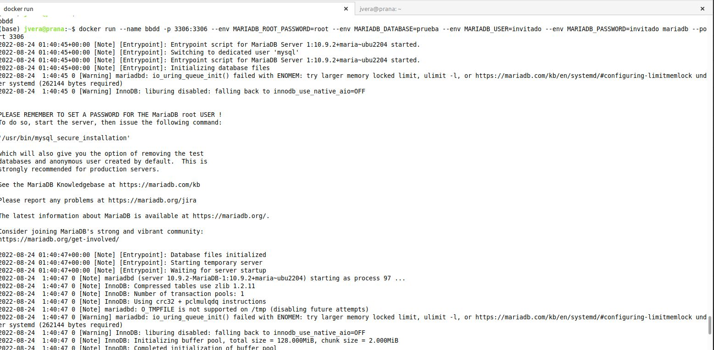
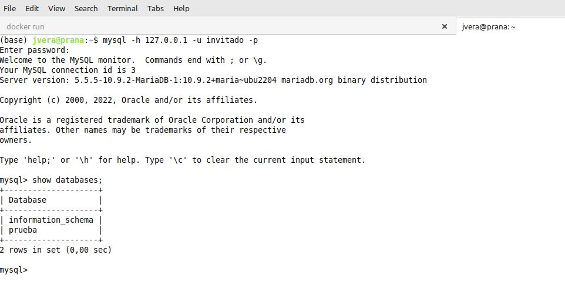
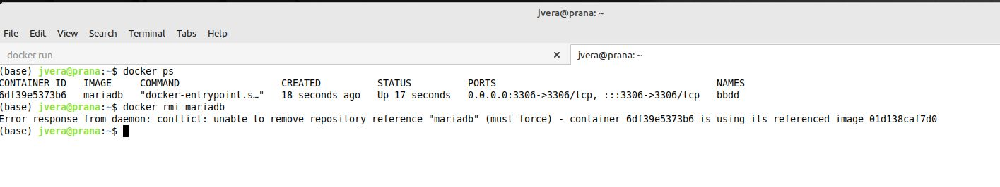

# Solucion Reto 2 Clase Docker

Script shell para levantar una base de datos mariadb:latest

````
#!/bin/bash
dockerbin=/usr/bin/docker

ROOT_PASSW=root
DATABASE=prueba
USER=invitado
PASSWORD=invitado

$dockerbin run --name bbdd -p 3306:3306 \
    --env MARIADB_ROOT_PASSWORD=$ROOT_PASSW \
    --env MARIADB_DATABASE=$DATABASE \
    --env MARIADB_USER=$USER \
    --env MARIADB_PASSWORD=$PASSWORD \
    mariadb --port 3306

````


Output ejecución contenedor MariaDB:


Comprobacion de usuario, password y database creada:



No se puede borrar la imagen "mariadb" si el contenedor está actualmente corriendo



[Comandos en un archivo bash SolucionReto02.sh](./SolucionReto02.sh)