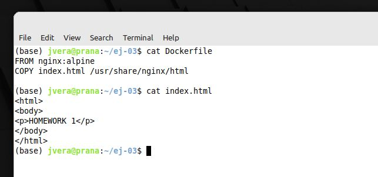
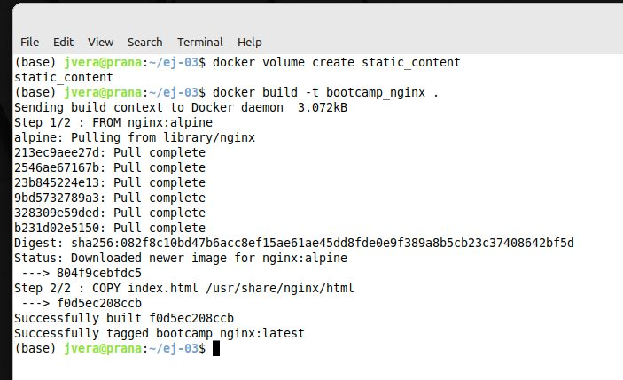
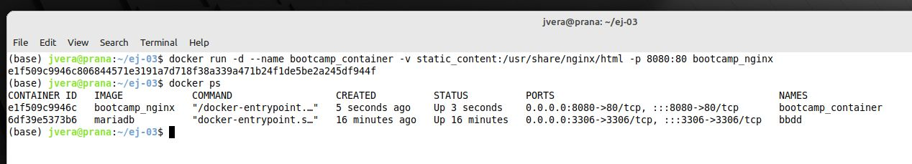
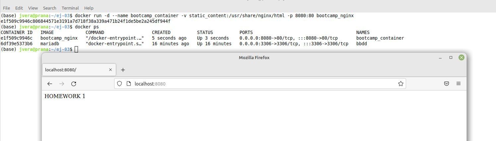
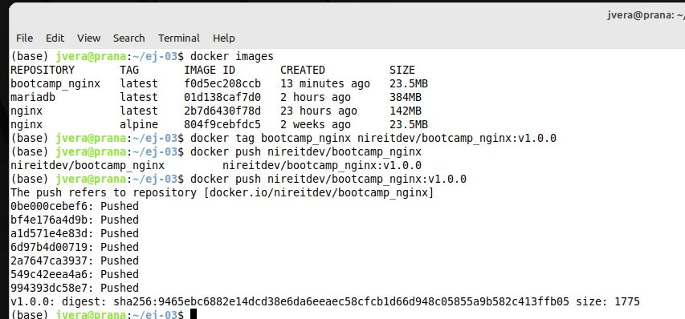
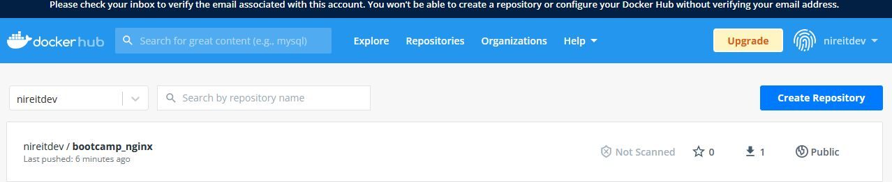

# Solucion Reto 3 Clase Docker

Crear un contenedor con contenido estatico en una imagen nginx:alpine y subirla al dockerhub

Cracion Dockerfile y de Index.html:

Creacion y build del Dockerfile:

Comprobacion de la ejecución:

Comprobación en el navegador:

Finalmente, push a Docker Hub de la imagen:

Imagen en Docker Hub:

## Archivos

[Dockerfile](./src/03/Dockerfile)

[Index.html](./src/03/index.html)