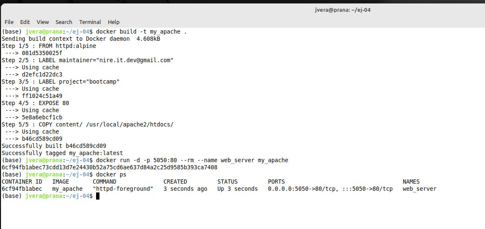
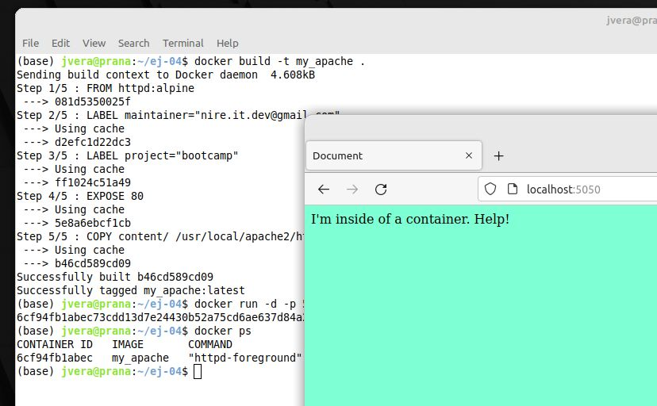

# Solucion Reto 4 Clase Docker

Para la solución del problema se utilizó la imagen oficial de Apache 2 "httpd". Se eligió el tag "alpine" por ser minimalista. 

La documentacion de la imagen indicaba que se debe copiar los archivos a **/usr/local/apache2/htdocs/**

Cracion Dockerfile y armado de la imagen:

Navegador mostrando la pagina web

## Archivos

[Dockerfile](./src/04/Dockerfile)

[contenido](./src/04/contents)