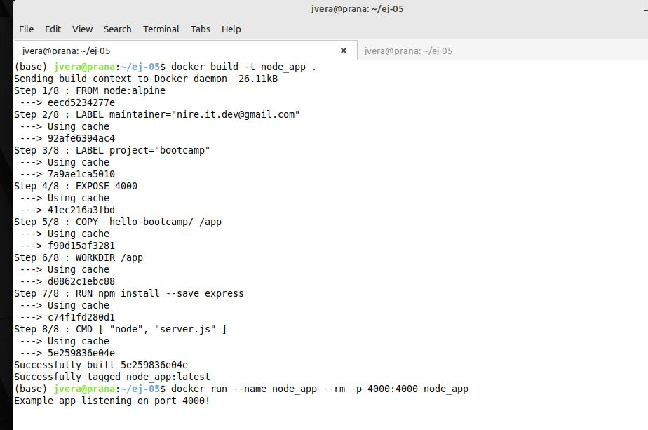
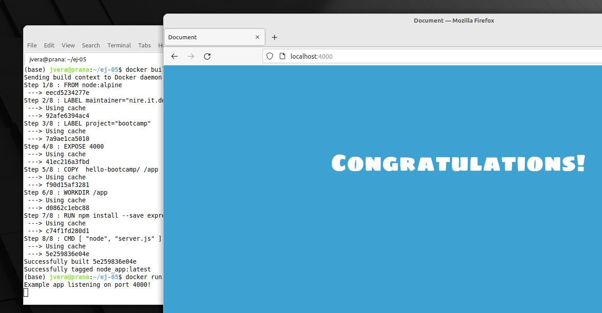
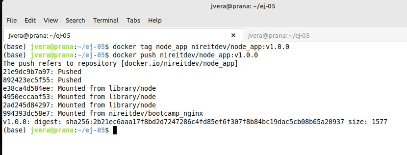
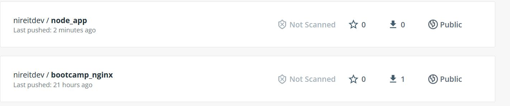

# Solucion Reto 5 Clase Docker

Para la solución del problema se utilizó la imagen oficial de Node "node".

Se eligió el tag "alpine" por ser minimalista. 

Cracion Dockerfile y armado de la imagen:

Navegador mostrando la pagina web

Push al Docker Hub de la imagen creadad:

Docker Hub:

## Archivos

[Dockerfile](./src/05/Dockerfile)

[contenido](./src/05/hello-bootcamp/)