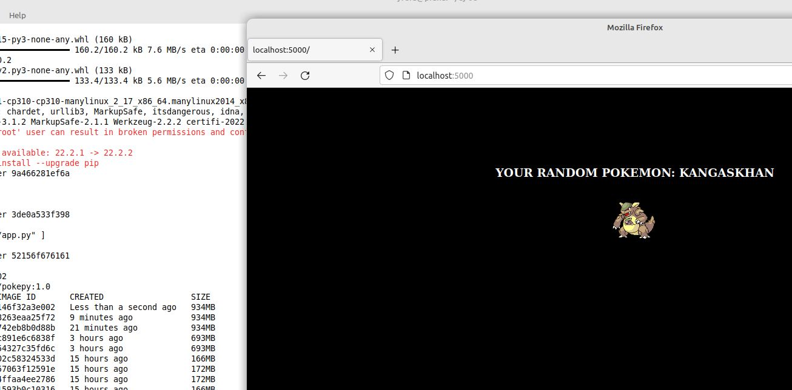
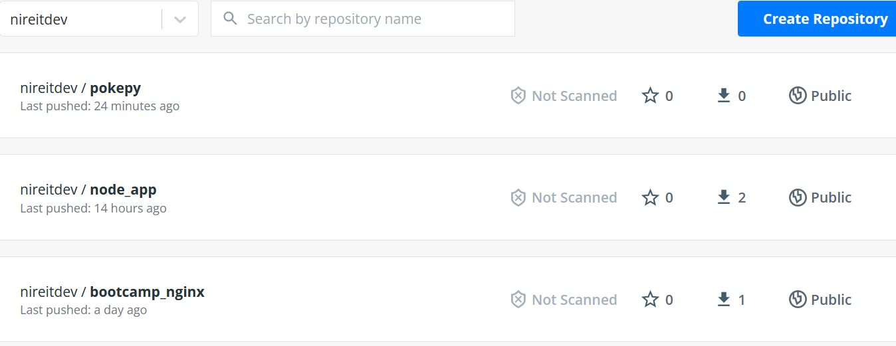

# Solucion Reto Bonus 8 Clase Docker

Ejecución completa utilizando un script Bash de una app hecha en flask. Luego la imagen se sube a docker hub.


Script Bash: 

````
#!/bin/bash

echo "Clonning..."

#Hago un fresh start:
rm -rf pokepy

git clone https://github.com/roxsross/pokepy pokepy

#Fix bug post clone repositorio: se necesita Jinja 2
cp ./requirements-fix.txt pokepy/requirements.txt

echo "Building Image..."

#build docker
cd pokepy
docker build -t nireitdev/pokepy:1.0 .
docker images

echo "Running..."

#Lo ejecuto iterativamente para ver la salida
docker run -it --name pokepy --rm -p 5000:5000 nireitdev/pokepy:1.0


echo "Pushing..."
#Push docker hub
docker push nireitdev/pokepy:1.0

echo "Bye."

````

Navegador:



Docker hub


## Archivos

Script Bash [resolucion08.sh](./src/08/resolucion08.sh)

Fix [requiremnt.txt fix](./src/08/requirements-fix.txt)

