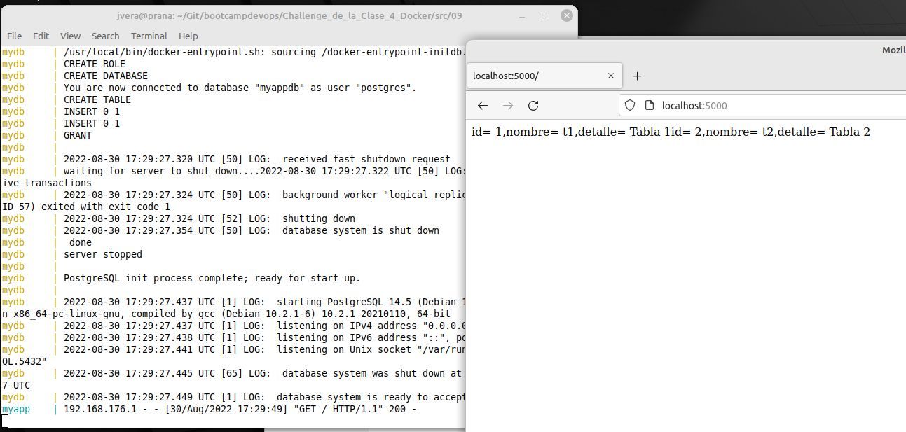

# Solucion Reto Bonus 9 Clase Docker

El problema reside en crear un archivo Docker-compose.yml que despliegue un sistema compuesto de una App en python y de una base de datos Postgres.

Una de las mejoras que se puede plantear es la utilizacin de un archivo `.env` que cargue todas las variables de entorno.

Además, en el script original `init-db.sh`  el usuario no tiene los permisos adecuados para acceder a la base `myappdb`. Para que en este caso de solo lectura de datos le puse el menor privilegio para hacer consultas "SELECT". 


Source [resolucion 9](./src/09)


Para ejecutar la solución:

````
git clone https://github.com/nireitdev/bootcampdevops.git
cd bootcampdevops/Challenge_de_la_Clase_4_Docker/src/09
docker-compose build
docker-compose up 
````

La pagina será visible desde la url `http://localhost:5000`




Para finalizar:

```
docker-compose down --rm all
```