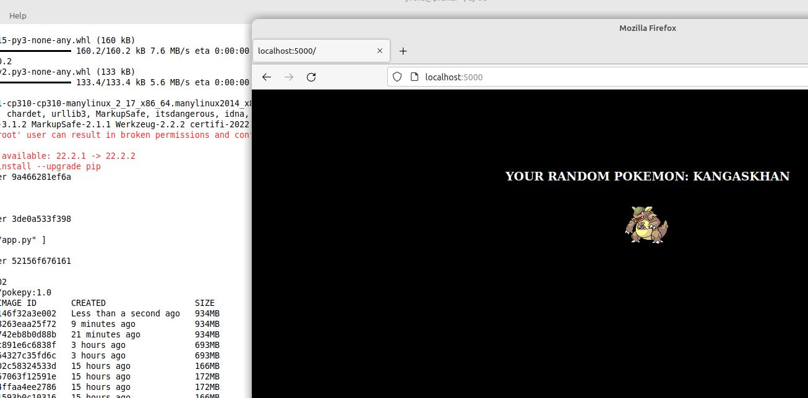

# Solucion Reto Bonus 9 Clase Docker

El problema reside en crear un archivo Docker-compose.yml que despliegue un sistema compuesto de una App en python y de una base de datos Postgres.

Una de las mejoras que se puede plantear es la utilizacin de un archivo `.env` que cargue todas las variables de entorno.

Un bug que encontée en el buildeo de la imagen de postgres es el usuario no tiene los permisos adecuados para acceder a la base `myappdb`. Para que funcione correctamente con usuario de menor privilegios se modifico el script de iniciación de la base de postgres. 

Navegador:

Docker hub

## Archivos

Script Bash [resolucion08.sh](./src/08/resolucion08.sh)

Fix [requiremnt.txt fix](./src/08/requirements-fix.txt)

