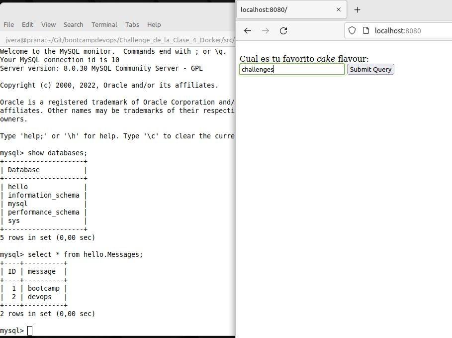
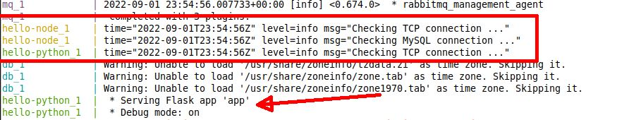
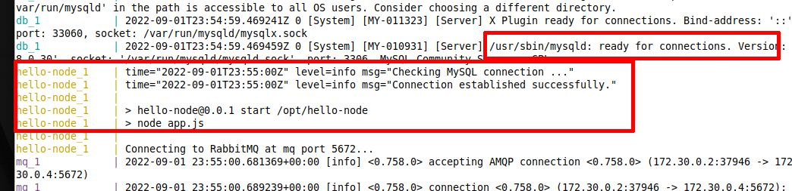

# Solucion Reto Bonus 10 Clase Docker

El ejercicio plantea un problema de disponibilidad de servicios. Cuando se levanta la app de NodeJs puede ser que la base de datos en Mysql no esté disponible.- 

Además se observa que la aplicación de NodeJs no funciona correctamente  XD .-

## Disponibilidad de servicios

La solución consiste en detectar *fehacientemente* la disponibilización de un servicio y que luego otro servicio dependiente se inicie en forma sincronizada.

**Importante:**
- La aplicación NodeJs depende de los servicios Mysql y MQTT.
- La aplicación Python sólo depende del servicio MQTT.


Docker-Compose provee el comando ``depends_on:`` para proveer guardas de inicios entre contenedores. Esto es, un contenedor sólo iniciara cuando los otros de cuales depende se hayan iniciado. Este comando sólo sirve para inicios de contenedores y no para verificar disponibilidad del servicio que provee la herramienta dockerizada. En otras palabras, no verifica si el servicio de Mysql se inició correctamente en el puerto 3306, sino que **sólo verifica que el contenedor arrancó correctamente**.

Investigué varias herramientas, muchas en bash y otras en Go. Elegí `Wait4x` que permite verificar el funcionamiento de servicios TCP en general y otros en forma particular tal como Mysql y RabbitMQ. 

RTFM [Wait4X](https://wait4x.dev/)
[Github] (https://github.com/atkrad/wait4x)

**Lo bueno**: los paquetes se instalan directamente con el administrador de paquetes de Alpine Linux.

**Lo malo**: sólo tiene la version 0.4 en los paquetes Alpine, pero es suficiente para este ejercicio.

La version actualizada 2.4 de Wait4X provee testeos de disponibilidad especificas para Rabbit, Mongodb, Redis, etc.- Si se desea isntalar la última version, entonces es necesario automatizar la descarga e instalacion directamente desde la pagina Git. Se debere utilizar la herramientas `wget` para descargar la ultima version del binario  y `tar` para descomprimirlo dentro del contenedor.


Para verificar que se cumnle las condiciones para la app de Nodejs se debería agregar al Dockerfile:

````
RUN apk add wait4x
CMD  wait4x tcp  mq:5672 -t 10m && wait4x mysql "root:password@tcp(db:3306)/hello" -t 10m && npm start

````
Y para la imagen de la App en Python:

````
RUN apk add wait4x
CMD wait4x tcp  mq:5672 -t 10m &&  python3 /home/myapp/app.py
````

## Conflicto entre los Dockerfiles y el archivo Docker-Compose

Se observa que en los Dockerfiles de build de las app de Node y Python se copia los archivos fuentes, y luego , en el caso de NodeJs, se instalan las dependencias.

Sin embargo ocurre un conflicto cuando se monta los volumenes desde el `docker-compose.yml`, sobreescribiendo todo el directorio que se utiliza para las apps y que se buildeó **anteriormente** con el Dockerfile. 

En el caso particular de la app de Node, se pisa el directorio `node_modules` y por lo tanto la aplicación no se ejecuta correctamente, terminando con un error de que no encuentra las dependencias.

**Posibles Soluciones**: 
- montar/copiar los directorios de la Apps desde los Dockerfiles y se elimina del ``docker-compose.yml``

- se elimina la copia de los directorios desde el Dockerfile y se monta desde el ``docker-compose.yml`` y posteriormene se agrega la sentencia de compose ``command:`` para que ejecute, por ej, ``npm install``

En este caso particular decido **eliminar** el montado de los volumenes desde el  ``docker-compose.yml``

Otra opción sería pasar todo al  ``docker-compose.yml`` y eliminar los Dockerfiles. No me parece **KISS** y seguramente lo dejaré para probar a futuro.

## Ejecutar la solución:
Finalmente la solución al problema es:

````
git clone https://github.com/nireitdev/bootcampdevops.git

cd bootcampdevops/Challenge_de_la_Clase_4_Docker/src/10/deployment

docker-compose build
docker-compose up 
````
La pagina será visible desde la url `http://localhost:8080`

El acceso a Mysql es visible en localhost puerto 3306:

````
mysql -h 127.0.0.1 -u root -ppassword hello
````

Para finalizar:

```
docker-compose down --rm all
```

## Capturas


Navegador con la app de python funcionando y el contenido de la base de datos:



Captura donde se muestra que la app de Python espera el servicio de MQTT para iniciar :



En este caso la app de Node espera la disponibilidad de la base de datos Mysql:

